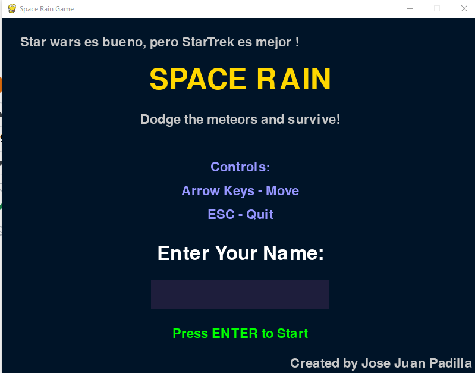
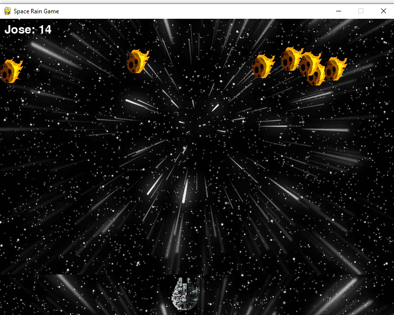

# My proyect game is SPACE RAIN

**Is a interactive game like a space alien invader, but in this case will be called SPACE RAIN**

🚀 Guía Rápida: Space Rain

1. Requisitos Previos

    Python 3.10 instalado.

    Librería Pygame (incluida en el entorno virtual del proyecto).

2. Cómo Iniciar Abre tu terminal en la carpeta JUEGO y ejecuta:

    Activar entorno (Opcional si ya tienes Pygame global):

        Windows: .\Scripts\activate

    Ejecutar juego:

        Comando: python main.py

3. Controles 🎮

    ⬅️ ➡️ Flechas / A-D: Mover la nave.

    Espacio: Disparar.

    ESC / Q: Salir.

4. Objetivo 🎯 Esquiva los meteoritos para acumular puntos. El juego guarda tu récord automáticamente. Si te tocan, pierdes.

# Preview

 
 